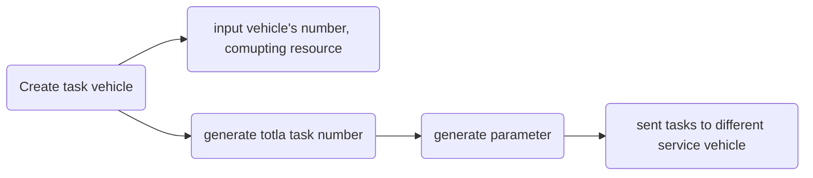
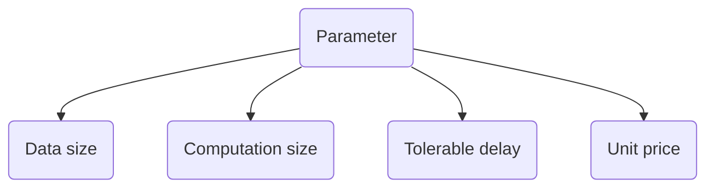
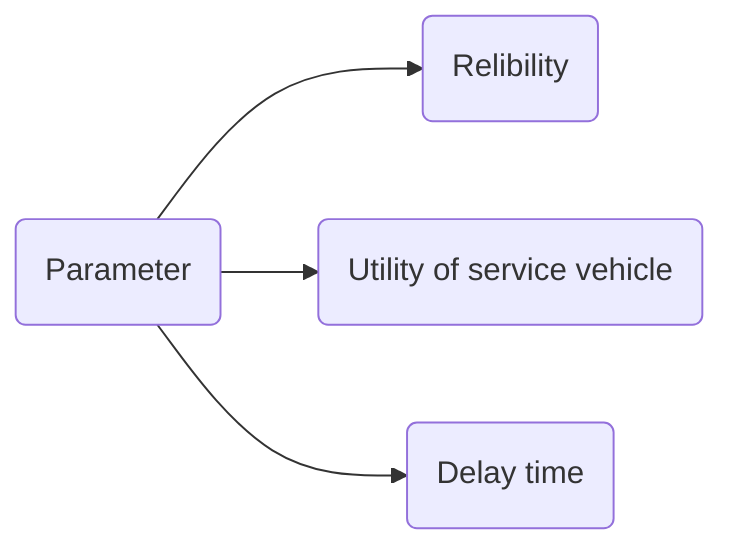

```flow
st=>start: Creat Service vehical
op1=>operation: Allocate task
cond=>condition: Is this a service vehicle?
op2=>operation: Task process
op3=>operation: Caculate reliability etc.
e=>end: Return parameter
st->op1->cond->op2->op3
cond(yes)->op2->op3->e
cond(no)->op1
```



