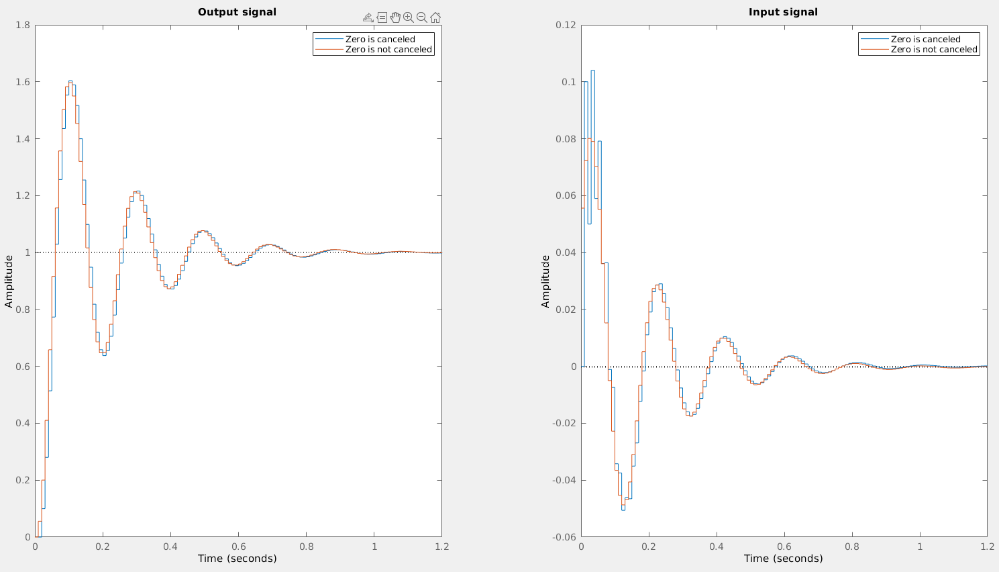

Liu Weihao

A0232935A

## Q.1

### a)

$$
H(z)=\frac{z+0.8}{z^2-1.5z+0.5}=\frac{B(z)}{A(z)}
$$

The zero is stable, we want wo cancel it, let $R(z)=z+0.8,\;S(z)=s_0z+s_1,\;A_o(z)=B(z)=z+0.8$
$$
A(z)R(z)+B(z)S(z)=A_m(z)A_o(z)\\
(z^2-1.5z+0.5)(z+0.8)+(z+0.8)(s_0z+s_1)=(z^2-1.8z+0.9)(z+0.8)\\
z^2+(s_0-1.5)z+s_1+0.5=z^2-1.8z+0.9\\
\Rightarrow
\begin{cases}
s_0-1.5=-1.8\\
s_1+0.5=0.9
\end{cases}\\
\Rightarrow
\begin{cases}
s_0=-0.3\\
s_1=0.4
\end{cases}
$$
So, $S(z)=-0.3z+0.4$
$$
\frac{Y(z)}{U_c(z)}=\frac{T(z)B(z)}{A(z)R(z)+B(z)S(z)}=\frac{T(z)B(z)}{A_m(z)A_o(z)}=\frac{T(z)}{A_m(z)}
$$

Besides, the steady-state gain should be one, and the zero has been canceled, so
$$
\frac{T(1)}{A_m(1)}=1\\
T(z)=A_m(1)=0.1\\
$$
The controller can be expressd as
$$
(q+0.8)u(k)=0.1u_c(k)-(-0.3q+0.4)y(k)
$$

### b)

Cause we don't need cancel zero, so let $R(z)=z+r_1,\;S(z)=s_0z+s_1,\;A_o(z)=z$,
$$
A(z)R(z)+B(z)S(z)=A_m(z)A_o(z)\\
(z^2-1.5z+0.5)(z+r_1)+(z+0.8)(s_0z+s_1)=z(z^2-1.8z+0.9)\\
z^3+(r_1-1.5+s_0)z^2+(0.5-1.5r_1+0.8s_0+s_1)+(0.5r_1+0.8s_1)=z^3-1.8z^2+0.9z\\
\Rightarrow\begin{cases}
r_1-1.5+s_0=-1.8\\
0.5-1.5r_1+0.8s_0+s_1=0.9\\
0.5r_1+0.8s_1=0
\end{cases}\\
\Rightarrow\begin{cases}
r_1=-0.219\\
s_0=-0.0812\\
s_1=0.137
\end{cases}
$$
So, $R(z)=z-0.219,\;S(z)=-0.0812z+0.137$

The steady-state gain should be one, and we want to decrease the order of process
$$
\begin{cases}
T(z)=t_oA_o(z)\\
\frac{T(1)B(1)}{A_m(1)A_o(1)}=1\\
\end{cases}\\
$$

$$
\Rightarrow T(z)=0.0556z\\
\frac{Y(z)}{U_c(z)}=\frac{T(z)B(z)}{A_m(z)A_o(z)}=\frac{0.0556z+0.04448}{z^2-1.8z+0.9}\\
$$

The controller can be expressed as:
$$
(q-0.219)u(k)=0.0556qu_c(k)-(-0.0812q+0.137)y(k)
$$

### c)

Use MATLAB to simulate the input signal and output signal.

As we can see, the output signals are almost same. But  after we canceled the process zero, the input signal is much smaller than the other. So we'd like to cancel the zeros.

## Q.2

### a)

Let $\Phi=\left[\matrix{0.5&1\\0.5&0.8}\right],\;\Gamma=\left[\matrix{0.2\\0.1}\right],\;\Phi_v=\left[\matrix{1\\0}\right],\;C=\left[\matrix{1&0}\right]$. Assume that  $x(0)=0$,we can apply z-transfer
$$
zX(z)=\Phi X(z)+\Gamma U(z)+\Phi_vV(z)\\
X(z)=(zI-\Phi)^{-1}\Gamma U(z)+(zI-\Phi)^{-1}\Phi_vV(z)\\
\begin{aligned}
Y(z) &=C(zI-\Phi)^{-1}\Gamma U(z)+C(zI-\Phi)^{-1}\Phi_vV(z)\\
&=\frac{0.2z-0.06}{z^2-1.3z-0.1}U(z)+\frac{z-0.8}{z^2-1.3z-0.1}V(z)
\end{aligned}
$$
Let $A(z)=z^2-1.3z-0.1,\;B(z)=0.2z-0.06,\;C(z)=z-0.8$, we can use deadbeat controler:
$$
A_m(z)=z^2
$$
The close loop transfer function can be expressed as:
$$
Y(z)=\frac{B(z)T(z)}{A(z)R(z)+B(z)S(z)}U_c(z)+\frac{C(z)R(z)}{A(z)R(z)+B(z)S(z)}V(z)
$$
The DC gain from disturbance to the output is:
$$
\frac{C(z)R(z)}{A_{cl}(z)}|_{z=1}=\frac{C(1)R(1)}{A_{cl}(1)}=0\\
\frac{B(z)T(z)}{A_{cl}(z)}|_{z=1}=\frac{B(1)T(1)}{A_{cl}(1)}=1
$$
Besides,  $B(z)$ is stable. So let $R(z)=(z-1)B(z)$, $S(z)=s_0z^2+s_1z+s_2$, $A_o(z)=zB(z)$, $A_{cl}(z)=A_m(z)A_o(z)=z^3B(z)$,
$$
A(z)R(z)+B(z)S(z)=A_{cl}(z)\\
A(z)B(z)(z-1)+B(z)S(z)=z^3B(z)\\
A(z)(z-1)+S(z)=z^3\\
z^3+(s_0-2.3)z^2+(s_1+1.2)z+(s_2+0.1)=z^3\\
\Rightarrow\begin{cases}
s_0=2.3\\
s_1=-1.2\\
s_2=-0.1\\
\end{cases}
$$
Then we can get:
$$
R(z)=(z-1)(0.2z-0.06)\\
S(z)=2.3z^2-1.2z-0.1\\
$$
And we want the DC gain from input signal to output is 1, and we wand to decress the order of the system so:
$$
\frac{B(z)T(z)}{A_{cl}(z)}|_{z=1}=\frac{B(1)T(1)}{A_{cl}(1)}=1\\
T(z)=z
$$
Then, the transfer function can be expressed as:
$$
\begin{aligned}
Y(z) &=\frac{B(z)T(z)}{A_{cl}(z)}U_c(z)+\frac{C(z)R(z)}{A_{cl}(z)}V(z)\\
&=\frac{1}{z^2}U(z)+\frac{(z-1)(z-0.8)}{z^3}V(z)
\end{aligned}
$$
The controller can be expressed as:
$$
(q-1)(0.2q-0.06)u(k)=qu_c(k)-(2.3q^2-1.2q-0.1)y(k)
$$

### b)

Compare with Prob.2 in Homework #2, this design doesn's need to create a observer. **So this design design is simpler!**

## Q.3

### a)

Let $A(z)=z^2-1,\; B(z)=z-0.5,\; A_m(z)=z^2,\; B_m(z)=1$. Because $B(z)$ is stable, and we want the close-loop transfer function close to the reference model, and reject constant disturbance. So, let $R(z)=(z-1)B(z),\;S(z)=s_0z^2+s_1z+s_2,\;A_o(z)=zB(z)$, we can get:
$$
A(z)R(z)+B(z)S(z)=A_{cl}(z)=A_o(z)A_m(z)\\
(z^2-1)(z-1)B(z)+(s_0z^2+s_1z+s_2)B(z)=z^3B(z)\\
z^3+(s_0-1)z^2+(s_1-1)z+(s_2+1)=z^3\\
\Rightarrow\begin{cases}
s_0=1\\
s_1=1\\
s_2=-1
\end{cases}
$$
We can get:
$$
R(z)=(z-1)(z-0.5)\\
S(z)=z^2+z-1
$$

The close-loop transfer function is:
$$
G(z)=\frac{T(z)B(z)}{A(z)R(z)+B(z)S(z)}=\frac{T(z)}{z^3}
$$
Because we want the close-loop transfer function as close to the reference model as possible, so let $T(z)=z$, the controller can be expressed as:
$$
(q-1)(q-0.5)u(k)=qu_c(k)-(q^2+q-1)y(k)
$$

### b)

The feedback controllor is same as **a)**, $R(z)=(z-1)(z-0.5),\;S(z)=z^2+z-1,\;U_{fb}(z)=-\frac{(z-1)(z-0.5)}{z^2+z-1}Y(z)$, the transfer function changes to:
$$
G(z)=H_{ff}(z)\frac{B(z)R(z)}{A(z)R(z)+B(z)S(z)}=H_{ff}\frac{R(z)}{zA_m(z)}
$$
We want the close-loop transfer function as close to the reference model as possible, so:
$$
H_{ff}\frac{R(z)}{zA_m(z)}=\frac{B_m(z)}{A_m(z)}\\
H_{ff}=\frac{zB_m(z)}{R(z)}=\frac{z}{(z-1)(z-0.5)}\\
U(z)=-\frac{(z-1)(z-0.5)}{z^2+z-1}Y(z)+\frac{z}{(z-1)(z-0.5)}U_c(z)
$$

## Q.4

### a)

We want to use $u(k)$ to control the output signal. So, we need to convert the equation so that it contains the input $u(k)$:
$$
\begin{aligned}
y(k+2) &=cy(k+1)+y^2(k)+u(k)\\
&=c[cy(k)+y^2(k-1)+u(k-1)]+y^2(k)+u(k)\\
&=y^2(k)+c^2y(k)+cy^2(k-1)+u(k)+cu(k-1)
\end{aligned}
$$
Then let $r(k+2)=y(k+2)$, the input signal can be expressed as:
$$
u(k)=r(k+2)-y^2(k)-c^2y(k)-cy^2(k-1)-cu(k-1)
$$

### b)

From **a)**, we can get
$$
B(z^{-1})=1+cz^{-1}
$$
The zero of $B(z)$ is: $z=-c$. If we want perfect tracking, $B(z^{-1})$ should be stable, that means:
$$
|c|\leqslant1
$$

